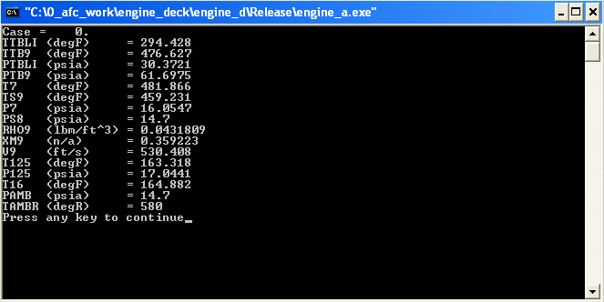

# ========================================
# Utility to Call Engine Performance Deck From C Language Interface:
# ========================================

## Utility to Call Engine Performance Deck From C Language Interface.

##
## I. Interactive Output of Utility:

##
## II. Utility "C" Interface Source Code: "./src/test_call_a.c"

##
## III. Utility Output File: "./output/OUT18.TXT":

